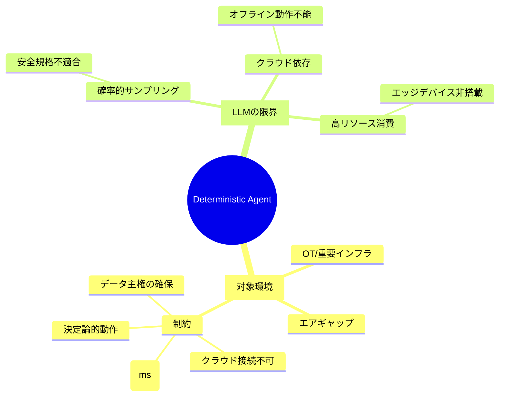
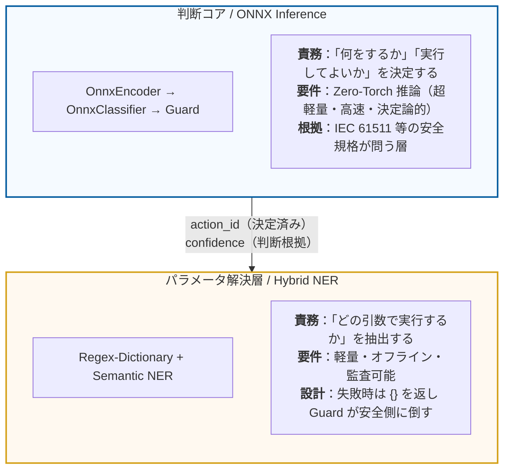
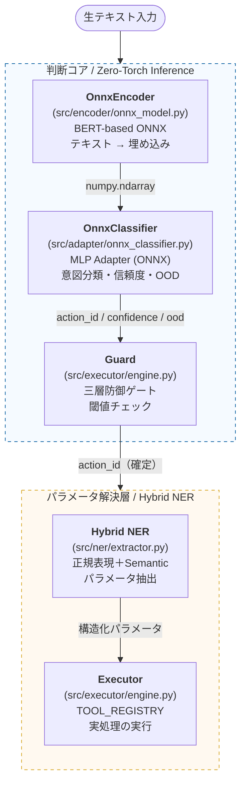

# Deterministic AI Agent (Hybrid ONNX System)

## 1. このプロジェクトが解くべき問題

### LLMが「使えない」環境が存在する

ChatGPTやGeminiに代表される大規模言語モデル（LLM）は、汎用的な知識処理において圧倒的な性能を発揮する。  
しかし、以下の条件が重なる環境では、LLMは**構造的に適用不能**である。

| 制約 | 理由 |
|---|---|
| **エアギャップ（外部ネットワーク遮断）** | クラウドAPIへのアクセスが物理的に不可能 |
| **リアルタイム性（ミリ秒単位の応答）** | LLM推論はレイテンシが大きすぎる |
| **決定論的判断の要求** | 「何をするか」の決定が確率的サンプリングに依存すると安全規格（IEC 61511等）に適合しない |
| **データ機密性** | 設備・プロセス情報を外部モデルに送信できない |



---

## 2. 設計思想：責務の分離と決定論の適用範囲

### パイプラインの責務分離

判断の「決定論性」とパラメータ抽出の「柔軟性」を分離する。



### 三層防御モデル (Triple-Guard Model)

本エージェントは、ハルシネーション（もっともらしい嘘）を物理的に排除し、以下の3層で安全性を担保する。

1.  **L1 (Determinism):** `argmax` による決定論的アクション選択。同一入力に対し、常に同一の結果を保証。
2.  **L2 (Confidence Gate):** 判断の自信（ソフトマックス確率）が閾値（デフォルト0.70）未満の場合、実行を拒絶。
3.  **L3 (OOD Detection):** 分布外入力（OOD）検知。重心ベースの余弦類似度を用い、産業ドメイン以外の入力（雑談等）を即座に排除。

---

## 3. アーキテクチャ

### パイプライン概要

推論フェーズでは **「Zero-Torch Inference」** を実現。
PyTorch を一切ロードせず、ONNX Runtime と Numpy のみで高速に動作する。



### 設計上の重要な判断

- **Zero-Torch 推論**: 開発時は PyTorch を使用するが、推論時は Numpy と ORT (ONNX Runtime) のみ。これにより起動時間は 3.2倍、推論は 3.1倍高速化された。
- **生成AIを使用しない**: テキスト生成ステップがないため、ハルシネーションが構造的に発生しない。
- **クラウド不要**: 推論はすべてローカルで完結。
- **NERは決定論的コアの外に置く**: NERの要件は「軽量・オフライン・監査可能・失敗を明示的に返すこと」であり、抽出失敗時は `{}` を返して Guard が安全側（不実行）に倒す設計で安全性を担保する。
- **ツールデータの外部化**: 診断や在庫などの静的データは `config/tools_data.yaml` に分離し、ロジックとデータを疎結合に保つ。

---

## 4. 性能実績（Measured Performance）

Windows 11 (WSL2) 上の AMD Ryzen 5 8540U 環境での測定結果。

| メトリクス | PyTorch (Baseline) | **ONNX (Optimized)** | 改善率 |
| :--- | :--- | :--- | :--- |
| **起動時間（コールドスタート）** | 9.29s | **2.87s** | **3.2倍 高速** |
| **推論レイテンシ** | 25.36ms | **8.08ms** | **3.1倍 高速** |
| **スループット** | ~39 ops/sec | **~123 ops/sec** | **3.1倍 向上** |
| **ライブラリ依存関係** | 重厚 (PyTorch) | **軽量 (Numpy/ORT)** | **RAM占有極小** |

---

## 5. インストールと実行

### 推論のみ（Zero-Torch / プロダクション環境）

```bash
# 推論に必要な最小限の依存関係
pip install numpy onnxruntime tokenizers pyyaml
```

```python
from deterministic_ai_agent.executor.engine import AgentEngine

# ONNXモデルから直接起動（PyTorch不要）
engine = AgentEngine.from_onnx(
    encoder_model="models/onnx/encoder/model.onnx",
    tokenizer_json="models/onnx/encoder/tokenizer.json",
    adapter_model="models/onnx/production_adapter.onnx",
    adapter_metadata="models/onnx/production_metadata.json"
)

result = engine.run_step("Conveyor_A vibration detected.")
print(result)
```

### 開発・学習環境（PyTorch を含む）

```bash
make install-dev
```

### 全テストの実行

```bash
# フォーマットチェック、型チェック、単体テストを統合実行
make test
```

---

## 6. ロードマップ

| フェーズ | 内容 | ステータス |
|---|---|---|
| **Phase 1** | Encoder → Adapter → Executor のパイプライン構築 | ✅ 完了 |
| **Phase 2** | 学習ループおよびデータセット管理の実装 | ✅ 完了 |
| **Phase 3** | Hybrid NER (Regex + Semantic) の実装 | ✅ 完了 |
| **Phase 4** | L2 信頼度ゲート・L3 OOD 検知の実装 | ✅ 完了 |
| **Phase 5** | **Zero-Torch 推論エンジンへの移行（ONNX化）** | ✅ 完了 |
| **Phase 6** | エッジデバイス（ARM64/RAM 512MB）での動作検証 | 🔲 予定 |
| **Phase 7** | ONNX Runtime C++ API 統合による完全ネイティブ動作 | 🔲 予定 |

---

## 7. ライセンス

MIT License
