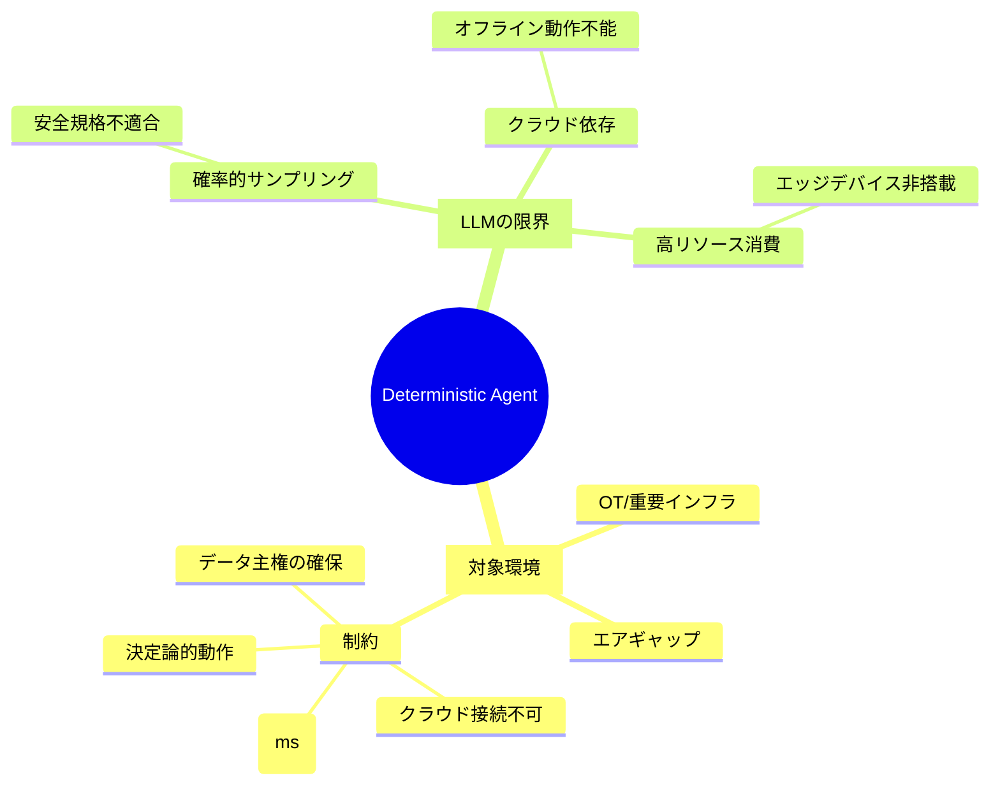
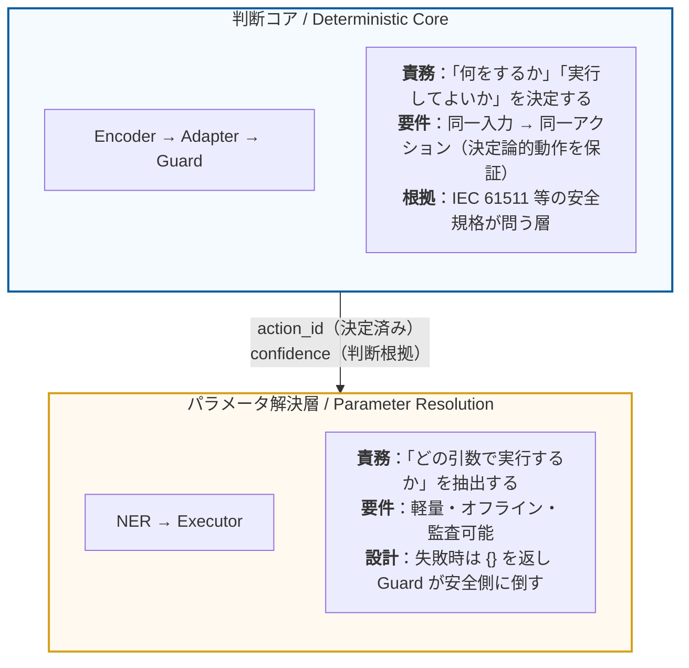
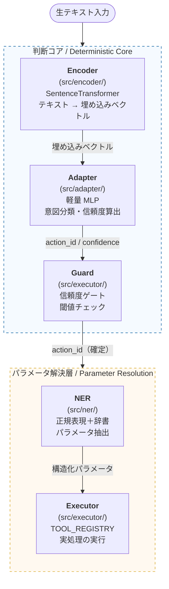

# Deterministic AI Agent (SentenceTransformer-Based)

## 1. このプロジェクトが解くべき問題

### LLMが「使えない」環境が存在する

ChatGPTやGeminiに代表される大規模言語モデル（LLM）は、汎用的な知識処理において圧倒的な性能を発揮する。  
しかし、以下の条件が重なる環境では、LLMは**構造的に適用不能**である。

| 制約 | 理由 |
|---|---|
| **エアギャップ（外部ネットワーク遮断）** | クラウドAPIへのアクセスが物理的に不可能 |
| **リアルタイム性（ミリ秒単位の応答）** | LLM推論はレイテンシが大きすぎる |
| **決定論的判断の要求** | 「何をするか」の決定が確率的サンプリングに依存すると安全規格（IEC 61511等）に適合しない |
| **データ機密性** | 設備・プロセス情報を外部モデルに送信できない |

製造業の**OT（Operational Technology）ネットワーク**、発電所・水処理施設などの**重要インフラ制御システム**、  
および軍・官公庁の**セキュアな情報処理環境**がその典型である。

### このプロジェクトの立ち位置

本プロジェクトは、**LLMの代替を目指すものではない**。  
LLMが物理的・規制的に参入できない戦場に対して、  
**「領域特化・決定論性・軽量・オフライン動作」** という4条件を同時に満たすAIエージェントの  
アーキテクチャを提供することを目的とする。



---

## 2. 設計思想：責務の分離と決定論の適用範囲

### パイプラインの責務分離

本プロジェクトのパイプラインは、責務の性質が異なる2層に分かれる。



> **なぜこの分離が重要か**  
> 「決定論」を NER（自然言語からの情報抽出）に要求することは概念の混同である。  
> 自然言語には表記ゆれ・省略・文脈依存が構造的に存在し、  
> 「同じ意味の文が常に同じ表層形を持つ」という前提が成り立たない。  
> 安全規格が実際に要求するのは「**誤ったアクションを取らないこと**」であり、  
> これは判断コアの決定論性と Guard による失敗吸収によって保証される。

### 判断コアの決定論レベル定義

判断コアが保証する決定論は、段階的に定義される。

| レベル | 定義 | 実装状況 |
|:---:|---|:---:|
| **L1** | 同一入力 → 同一 action_id（`argmax` による確率的サンプリングの排除） | ✅ 実装済み |
| **L2** | 信頼度スコア付き出力 + 実行ゲート（閾値未満は不実行・エスカレーション） | ✅ 実装済み |
| **L3** | 分布外入力（OOD）の検知と拒否（未知入力を「不明」として安全側に倒す） | 🔲 Phase 4 |

### パラメータ解決層の設計要件

NER に求めるのは決定論だけでなく、以下の3点である。

| 要件 | 内容 |
|---|---|
| **ハイブリッド抽出** | **Regex (確実性)** ＋ **Semantic (柔軟性)** の2段構え。表記ゆれを許容しつつ誤検知を防ぐ |
| **明示的失敗** | 抽出できない場合は `{}` を返す。推測・補完は行わない |
| **監査可能性** | どの手法（Regex/Semantic）で抽出されたかをログに記録 |
| **軽量・オフライン** | 外部モデル不要。SentenceTransformer のローカル推論を活用 |

---

## 3. アーキテクチャ

### パイプライン概要



### 設計上の重要な判断

- **Encoderの重みは固定**: ドメイン適応はAdapterのみで行う。  
  事前学習済みモデルへの依存を最小限にしつつ、学習コストを大幅に削減する。
- **生成AIを使用しない**: テキスト生成ステップがないため、ハルシネーションが構造的に発生しない。
- **クラウド不要**: 推論はすべてローカルで完結する。モデルファイルをオフラインで配布可能。
- **軽量設計**: エッジデバイス・産業用PCでの動作を前提とし、GPU非依存で動作する。
- **NERは決定論的コアの外に置く**: NER（自然言語からの情報抽出）に決定論を要求することは概念の混同である。  
  NERの要件は「軽量・オフライン・監査可能・失敗を明示的に返すこと」であり、  
  抽出失敗時は `{}` を返して Guard が安全側（不実行）に倒す設計で安全性を担保する。

### ディレクトリ構成

```
.
├── src/
│   ├── encoder/        # テキスト埋め込み（SentenceTransformer ラッパー）
│   ├── adapter/        # 意図分類 MLP（学習・推論）
│   ├── ner/            # パラメータ抽出（実装予定）
│   └── executor/       # ツール選択・実行エンジン
├── tools/              # ツール関数の定義（診断・在庫確認等）
├── data/               # 学習用ラベル付きデータ（sample_data.json）
└── tests/              # 単体テスト
```

---

## 4. インストール方法

### 通常インストール

```bash
make install
```

### 開発用インストール（Ruff / Mypy / Pytest を含む）

```bash
make install-dev
```

---

## 5. 開発サイクル

### コードの整形とチェック

```bash
make format      # Ruff によるコード整形
make check       # Ruff によるリンターチェック
make type-check  # Mypy による型チェック
```

### テストの実行

`pytest` を実行すると、ロジックテストに加えて  
**Ruff のフォーマットチェックと Mypy の型チェックも同時に実行される**（`pyproject.toml` の設定による）。

```bash
make test
```

### シミュレーションの実行

`data/sample_data.json` のサンプル入力をパイプライン全体に通すデモ。

```bash
make run-sample
```

---

## 6. ロードマップ

| フェーズ | 内容 |
|---|---|
| **Phase 1（現在）** | Encoder → Adapter → Executor のパイプライン骨格 |
| **Phase 2** | Adapter の学習ループ実装（`sample_data.json` を使った訓練） |
| **Phase 3** | NER / Slot Filling の実装（`src/ner/`） |
| **Phase 4** | L2 信頼度スコア出力・L3 OOD 検知の実装 |
| **Phase 5** | 実機 OT 環境でのプロトタイプ検証 |

---

## 7. ライセンス

MIT License
